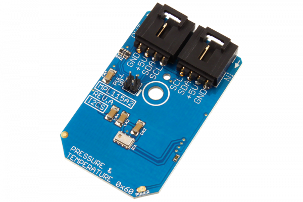

# MPL115A2

Freescale’s MPL115A2 employs a MEMS pressure sensor with an I2C interface to provide accurate Pressure/Altitude and Temperature data.The sensor outputs are digitized by a high resolution 24-bit ADC. It is capable of detecting a change in only 0.05 kPa which equates to a 0.3m change in altitude.
This Device is available from www.ncd.io 

[SKU: MPL115A2_I2CS]

(https://store.ncd.io/product/mpl115a2-digital-barometer-50-to-115-kpa-i2c-mini-module/)
This Sample code can be used with Arduino.

Hardware needed to interface MPL115A2 sensor with Arduino

1. <a href="https://store.ncd.io/product/i2c-shield-for-arduino-nano/">Arduino Nano</a>

2. <a href="https://store.ncd.io/product/i2c-shield-for-arduino-micro-with-i2c-expansion-port/">Arduino Micro</a>

3. <a href="https://store.ncd.io/product/i2c-shield-for-arduino-uno/">Arduino uno</a>

4. <a href="https://store.ncd.io/product/dual-i2c-shield-for-arduino-due-with-modular-communications-interface/">Arduino Due</a>

5. <a href="https://store.ncd.io/product/mpl115a2-digital-barometer-50-to-115-kpa-i2c-mini-module/">MPL115A2 Digital Barometer Sensor</a>

6. <a href="https://store.ncd.io/product/i%C2%B2c-cable/">I2C Cable</a>

MPL115A2:

Freescale’s MPL115A2 employs a MEMS pressure sensor with an I2C interface to provide accurate Pressure/Altitude and Temperature data.The sensor outputs are digitized by a high resolution 24-bit ADC. It is capable of detecting a change in only 0.05 kPa which equates to a 0.3m change in altitude.

Applications:

• Personal electronics altimetry

• Weather station equipment

• Navigation and map assist

• HVAC, etc.

How to Use the MPL115A2 Arduino Library

The MPL115A2 has a number of settings, which can be configured based on user requirements.
          
1.Address calling:The following command is used to call the MPL115A2 sensor to begin the transmission.

            mpl.getAddr_MPL115A2(MPL115A2_ADDRESS_DEFAULT);        // 0x60
            
2.Output measurement:The following command is used to measure the output of MPL115A2 sensor.             
             
             mpl.Measure_PressureTemperature();
